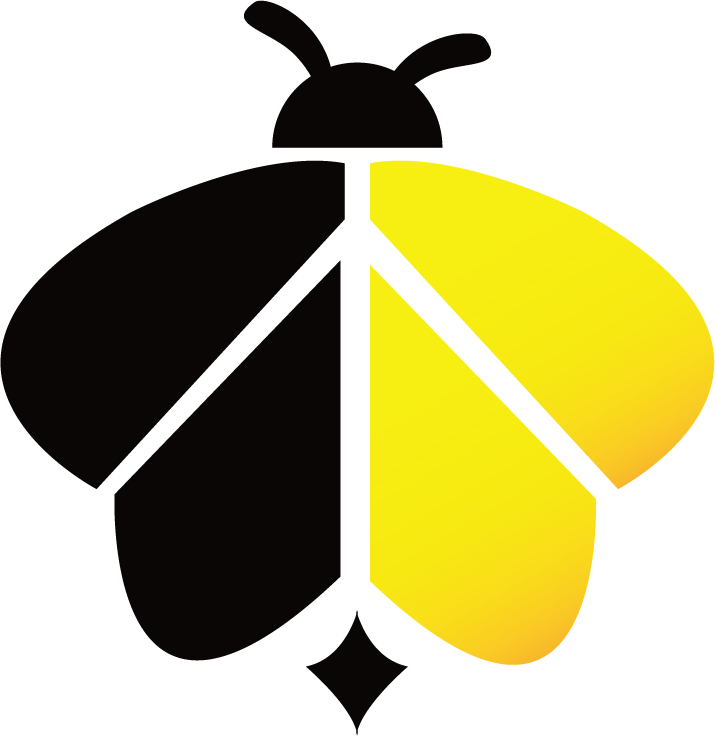
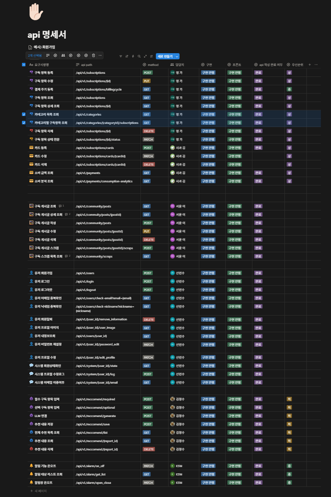

 

  

흩어진 구독시스템을 한번에 
효율을 높이는 통합 구독 관리 플랫폼
  
***Subees_project***

  

-----

### Backend

### Database & Tools

### Collaboration

---

## 👥 팀원 소개

<table align="center">
  <tr>
    <td align="center" width="180">
      
       
      <b>조장: 김가영</b>
       
      
    </td>

  <td align="center" width="180">
      
       
      <b>김다솜</b>
       
      
    </td>

  <td align="center" width="180">
      
       
      <b>김승욱</b>
       
      
    </td>

  <td align="center" width="180">
      
       
      <b>신민수</b>
       
      
    </td>

  <td align="center" width="180">
      
       
      <b>이서윤</b>
       
      
    </td>
  </tr>
</table>

---

## 📚 DevOps Repository 목차

- [📌 프로젝트 개요](#프로젝트-개요)
- [🎯 서비스 목표](#서비스-목표)
- [🧾 요구사항 정의서](#요구사항-정의서)
- [🗺️ ERD](#erd)
- [📋 테이블 명세서](#테이블-명세서)
- [🏗️ 시스템 아키텍처](#시스템-아키텍처)
- [📑 API 명세서](#api-명세서)
- [📝 회고록](#회고록)

---

<b>📌 프로젝트 개요</b>

 
  
 ### 프로젝트 배경
  국내 구독 시장의 성장으로 사용자 1인당 평균 3개 이상의 서비스를 이용하는 것이 일반화되었지만 
  서비스가 플랫폼별로 분산되어 있어 구독 정보와 결제 내역을 한눈에 파악하기 어려운 문제가 발생하고 있습니다. 
  이로 인해 무료 체험 종료 후 자동 결제, 사용하지 않는 구독의 지속 결제, 유사 서비스의 중복 구독 등
  다양한 비효율이 발생하고 있으며, 사용자 피로도 또한 증가하고 있습니다.
  
  이러한 문제를 해결하기 위해, 여러 구독 정보를 한곳에서 통합 관리하고 지출을 효율적으로 관리할 수 있는 올인원 구독 관리 서비스의 필요성이 증가하고 있습니다.  
  
  ### 주요 기능
  
  💳 구독 자산 관리 
  구독 서비스의 결제일, 금액, 결제 주기 등 핵심 정보를 통합 관리하고, 구독 상태(활성 / 해지)를 기준으로 전체 구독 현황을 한눈에 조회할 수 있도록 설계했습니다.
  
  📊 소비 분석 및 알림 
  월별 및 카테고리별 구독 지출을 시각화하고, 소비 패턴 분석과 결제 예정일 알림 기능을 통해 체계적인 지출 관리를 지원하도록 구성했습니다.
  
  💬 구독 커뮤니티 
  사용자 간 구독 경험과 정보를 공유할 수 있도록 커뮤니티 기능을 제공하며, 게시글 저장 및 외부 공유가 가능한 구조로 설계했습니다.
  
  🤖 맞춤형 추천 및 최적화 
  사용자의 소비 패턴과 구독 데이터를 기반으로 유사 서비스 분석 및 최적의 구독 조합을 제안할 수 있도록 설계했습니다.
  

  
  ---
  
  
  

  
<b>🎯 서비스 목표</b>

   
  
  - 사용자 구독 정보와 결제 데이터를 통합 관리할 수 있는 백엔드 시스템을 구축합니다.
  - 결제일, 금액, 주기 등 핵심 데이터를 안정적으로 관리하여 구독 현황 조회와 소비 분석 기능을 지원합니다.
  - 알림, 분석, 추천 기능에 필요한 데이터를 일관성 있게 제공하여 서비스의 확장성과 활용도를 높입니다.

---

<b>🧾 요구사항 정의서</b>

 

- [요구사항 정의서 바로가기](https://docs.google.com/spreadsheets/d/1t28YAF3teou6grdUzRbnRs2NyKi5boFY/edit?gid=955682159#gid=955682159)

  

---

<b>🗺️ ERD</b>

 

- [ERD 바로가기](https://www.erdcloud.com/d/osSpqKzTmS8zueTJs)

  

---

<b>📋 테이블 명세서 및 제약 조건</b>

 

- [테이블 명세서 바로가기](https://docs.google.com/spreadsheets/d/1t28YAF3teou6grdUzRbnRs2NyKi5boFY/edit?gid=2057065080#gid=2057065080)

  

---

<b>🏗️ 시스템 아키텍처</b>

 

- [시스템 아키텍처 바로가기](https://app.cloudcraft.co/view/861df300-1950-40d0-9379-f620c6eecfff?key=c2b40a58-e62b-4c42-aef1-63be712683c9)

  

---

<b>📑 API 명세서</b>

 

- [API 명세서 바로가기](https://www.notion.so/API-342712dca4bf801a882fcc78e4443f21?source=copy_link)

  

---

<b>📝 회고록</b>

 

### ✏️ 김가영
>

 

### ✏️ 김다솜
>

 

### ✏️ 김승욱
>
 

### ✏️ 신민수
>
 

### ✏️ 이서윤
>
다음 프로젝트에서는 개발을 시작하기 전에 구조를 더 꼼꼼하게 정리하고 들어가야겠다고 생각했다.

